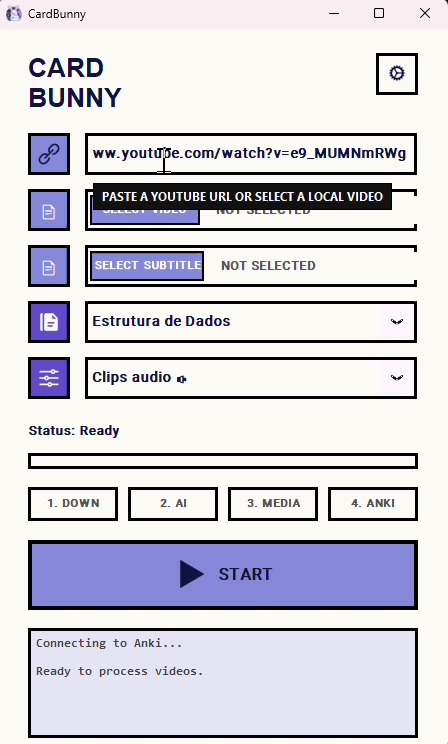
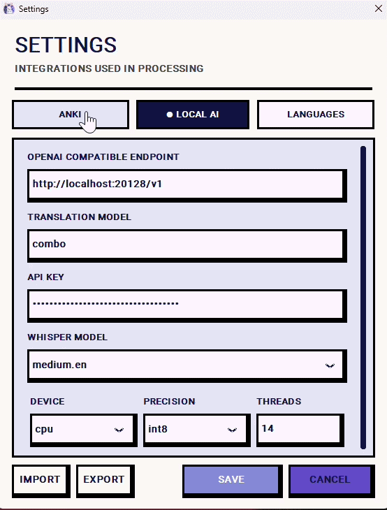

<p align="center">
  
</p>

<h1 align="center">CardBunny 🐰</h1>

<p align="center">
  <strong>AI-powered language learning from videos with Anki</strong>
</p>

<p align="center">
  
  
  
</p>

CardBunny transforms video scenes into Anki flashcards automatically. It accepts YouTube links or local videos, transcribes dialogue using AI, translates it, and slices the media into digestible, reviewable study cards.

---

## ✨ Features

- 🎥 **Video Slicing**: Automatically generates WebM video clips for each spoken sentence.
- 🎵 **Audio Extraction**: Saves the exact scene audio in MP3 format.
- 🖼️ **Scene Snapshots**: Captures a high-quality JPG image of the scene.
- 📝 **AI Transcription**: Uses **Faster-Whisper** to accurately transcribe spoken dialogue.
- 🌐 **AI Translation**: Connects to any OpenAI-compatible API to translate sentences into your target language.
- ⚡ **Seamless Integration**: Directly pushes generated cards and media to Anki via **AnkiConnect**.

---

## 🎨 Interface

<p align="center">
  
  
</p>

---

## ⚙️ Processing Workflow

1. **Download**: Fetches the video from YouTube or loads a local file.
2. **Transcribe**: Uses Faster-Whisper to identify and transcribe all speech regions.
3. **Audit**: Automatically audits and skips non-speech or silent regions.
4. **Translate**: Pushes the dialogue through an OpenAI-compatible API endpoint.
5. **Slice**: Uses FFmpeg to generate exact video clips, audio files, and images for every sentence.
6. **Sync**: Sends the media and notes directly to your Anki deck through AnkiConnect.

---

## 🚀 Getting Started

### Requirements
- **Windows 10 or 11**
- **Python 3.10+**
- **Anki** running with the [AnkiConnect](https://ankiweb.net/shared/info/2055492159) add-on installed
- **FFmpeg and FFprobe** available in your `PATH`
- An **OpenAI-compatible** translation service (like Ollama, LMStudio, or OpenAI API)

### Installation

Clone the repository and run the setup script:

```powershell
setup.bat
```

This script creates the `venv` virtual environment and installs all required dependencies.

### Launching

To start the application, simply run:

```powershell
run.bat
```

Or launch it directly using python:

```powershell
venv\Scripts\python.exe src\main.py
```

---

## 📖 Usage Guide

1. Open **Anki** and ensure **AnkiConnect** is active.
2. Start **CardBunny**.
3. Paste a **YouTube URL** or select a **Local Video**.
4. *(Optional)* Select a local `.srt` subtitle file to bypass transcription.
5. Choose your target **Deck** and **Note Type**.
6. Map the generated content (Video, Audio, Source Text, Translation) to your Anki fields.
7. Click the **Play** button to begin processing!

### Supported Inputs:
- YouTube URL
- Local video file
- YouTube URL + Local subtitles
- Local video + Local subtitles

---

## 🛠️ Configuration

Click the **Gear** icon in the app to configure your integrations:

| Section | Options |
| --- | --- |
| **Anki** | AnkiConnect address, default deck, and default note type. |
| **Local AI** | Endpoint, translation model, API key, Whisper model size, compute device, precision, and CPU threads. |
| **Languages** | Video source language and target translation language. |

> **Note**: Settings are saved in `config.json`. You can easily import/export settings directly from the interface.

### Recommended Whisper Settings
For a balanced CPU configuration, we recommend:
```json
{
  "model_size": "medium",
  "device": "cpu",
  "compute_type": "int8",
  "cpu_threads": 8
}
```
*The model is downloaded automatically on first use. Use `small` for faster processing, or `large-v3` for maximum accuracy.*

---

## 📂 Temporary Files

CardBunny creates a temporary workspace for each run:
```text
workspace_<id>/
├── video.mp4
├── original.srt
├── translated.srt
├── transcription_audit.txt
└── slices/
    ├── *.webm
    ├── *.mp3
    └── *.jpg
```
When processing finishes successfully, the application will prompt you to clean up or preserve these files.

---

## ❓ Troubleshooting

- **Cannot find Anki**: Open Anki, ensure AnkiConnect is installed, and check that the default address is `http://127.0.0.1:8765`.
- **Translation service not responding**: Open settings and verify your Endpoint URL, Model Name, and API Key.
- **First run is very slow**: The Whisper model must be downloaded on its first run. It will be cached locally for all subsequent runs.
- **Batch failed partway**: CardBunny automatically halts the batch and attempts to roll back any notes/media sent during that run to prevent incomplete cards.

---

## 📦 Building for Windows

To generate a standalone `.exe`, ensure you have installed the PyInstaller dependencies inside the virtual environment and run:

```powershell
venv\Scripts\pyinstaller.exe --noconfirm CardBunny.spec
```

## Star History

<a href="https://www.star-history.com/?repos=wenderfl%2Fcardbunny&type=date&legend=top-left">
 <picture>
   <source media="(prefers-color-scheme: dark)" srcset="https://api.star-history.com/chart?repos=wenderfl/cardbunny&type=date&theme=dark&legend=top-left" />
   <source media="(prefers-color-scheme: light)" srcset="https://api.star-history.com/chart?repos=wenderfl/cardbunny&type=date&legend=top-left" />
   
 </picture>
</a>

The resulting build will be located at `dist\CardBunny\CardBunny.exe`.
*(Note: Always distribute the complete `dist\CardBunny` directory, as the executable depends on the `_internal` folder).*
