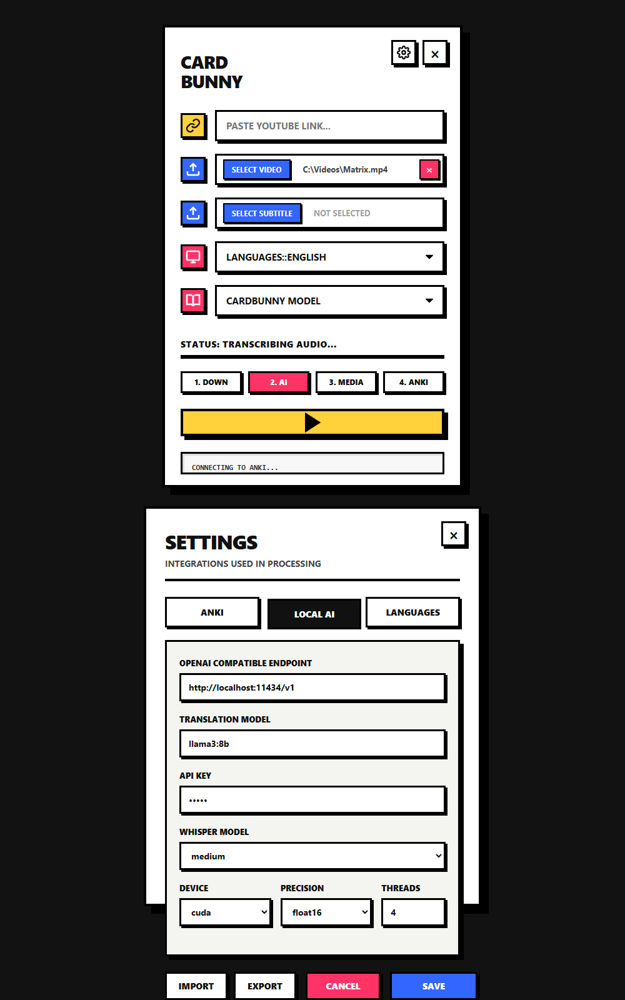

<p align="center">
  
  
</p>

<h1 align="center">CardBunny</h1>
AI-Powered Language Learning from Videos with Anki

O CardBunny transforma cenas de vídeos em cards do Anki com:

- Frase original em inglês
- Tradução em português brasileiro
- Clipe de vídeo em WebM
- Áudio da cena em MP3
- Imagem da cena em JPG

## Interface

<p align="center">
  
</p>

> A imagem mostra a tela principal e a janela de configurações. A interface segue uma identidade neo-brutalista com alto contraste, bordas marcadas e indicadores visuais para cada etapa do processamento.

## O que o aplicativo faz

O CardBunny recebe um vídeo do YouTube ou um arquivo local, identifica os diálogos e cria cards contendo:

- frase original;
- tradução;
- trecho de vídeo em WebM;
- áudio da cena em MP3;
- imagem da cena em JPG;
- identificador do card.

Antes do processamento, é possível escolher exatamente qual conteúdo será enviado para cada campo do tipo de nota selecionado.

## Fluxo de processamento

1. Baixa o vídeo ou utiliza um arquivo local.
2. Transcreve o áudio com Faster-Whisper.
3. Audita regiões de voz que ficaram sem texto.
4. Traduz as falas usando um endpoint compatível com a API da OpenAI.
5. Gera os clipes, áudios e imagens com FFmpeg.
6. Envia as mídias e notas ao Anki por meio do AnkiConnect.

## Requisitos

- Windows 10 ou 11;
- Python 3.10 ou mais recente;
- Anki aberto com o add-on [AnkiConnect](https://ankiweb.net/shared/info/2055492159);
- FFmpeg e FFprobe disponíveis no `PATH`;
- serviço de tradução compatível com a API da OpenAI;
- conexão com a internet para vídeos do YouTube e para o primeiro download do modelo Whisper.

## Instalação

Clone o repositório e execute:

```powershell
setup.bat
```

O script cria o ambiente virtual `venv` e instala as dependências de [requirements.txt](requirements.txt).

Para iniciar o aplicativo:

```powershell
run.bat
```

Também é possível executar diretamente:

```powershell
venv\Scripts\python.exe main.py
```

## Como usar

1. Abra o Anki e confirme que o AnkiConnect está ativo.
2. Inicie o CardBunny.
3. Cole uma URL do YouTube ou selecione um vídeo local.
4. Opcionalmente, selecione uma legenda original em `.srt`.
5. Escolha o deck e o tipo de nota.
6. Clique no botão amarelo de iniciar.
7. Revise o mapeamento dos campos.
8. Confirme para iniciar o processamento.

As entradas aceitas são:

- URL do YouTube;
- vídeo local;
- URL com legenda local;
- vídeo e legenda locais.

## Configurações

O botão de engrenagem abre três grupos de configuração:

| Seção | Opções |
| --- | --- |
| Anki | Endereço do AnkiConnect, deck padrão e tipo de nota |
| Local AI | Endpoint, modelo de tradução, chave de API, modelo Whisper, dispositivo, precisão e threads |
| Languages | Idioma do vídeo e idioma de destino da tradução |

As configurações são armazenadas em `config.json`. A interface também permite importar e exportar configurações em JSON.

### Whisper

Uma configuração equilibrada para CPU é:

```json
{
  "model_size": "medium.en",
  "device": "cpu",
  "compute_type": "int8",
  "cpu_threads": 8
}
```

O modelo é baixado automaticamente na primeira execução. Para priorizar velocidade, utilize `small.en`; para priorizar precisão, utilize `medium.en` ou um modelo maior compatível com o hardware.

## Mapeamento dos campos

Cada campo do tipo de nota pode receber um dos seguintes conteúdos:

- áudio da cena;
- clipe de vídeo;
- imagem da cena;
- legenda original;
- legenda traduzida;
- identificador do card;
- nenhum conteúdo.

O mapeamento é salvo separadamente para cada tipo de nota.

## Arquivos temporários

Cada execução cria uma pasta de trabalho:

```text
workspace_<id>/
├── video.mp4
├── original.srt
├── translated.srt
├── transcription_audit.txt
└── slices/
    ├── *.webm
    ├── *.mp3
    └── *.jpg
```

Ao terminar, o aplicativo permite excluir ou preservar essa pasta.

## Solução de problemas

### O aplicativo não encontra o Anki

Abra o Anki, confirme que o AnkiConnect está instalado e teste o endereço padrão:

```text
http://127.0.0.1:8765
```

### O serviço de tradução não responde

Confira na tela de configurações se o endpoint, o modelo e a chave de API correspondem ao serviço local utilizado.

### O primeiro processamento demora

O modelo Whisper precisa ser baixado na primeira utilização. Depois disso, ele permanece no cache local.

### Um lote falhou pela metade

O aplicativo interrompe o lote e tenta reverter as notas e mídias enviadas naquela execução, evitando a criação de um deck incompleto.

## Build para Windows

Com as dependências e o PyInstaller instalados no ambiente virtual:

```powershell
venv\Scripts\pyinstaller.exe --noconfirm CardBunny.spec
```

O resultado é gerado em:

```text
dist\CardBunny\CardBunny.exe
```

Distribua a pasta `dist\CardBunny` completa, pois o executável depende dos arquivos presentes em `_internal`.
